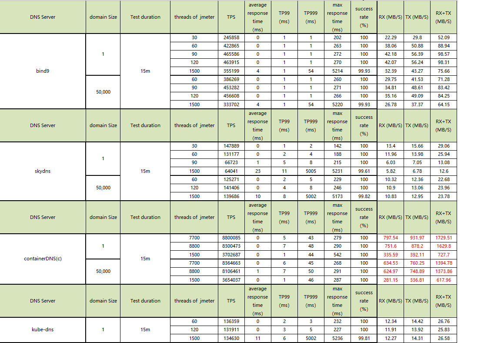

[English](README.md)

# KDNS

## 项目简介

 KDNS是一个基于DPDK实现的高性能DNS Server服务。服务不依赖数据库，提供restful API 用户可以将数据更新给Server。

## 下载使用

### 1. 下载源码，编译

支持的OS发行版本: Centos-7.2或者Centos-7.4，第一次编译make all，之后可以只编译编译kdns（make kdns）。

```bash
git clone https://github.com/tiglabs/containerdns.git
cd containerdns/kdns
make all
```

### 2. 配置参数，启动服务

KDNS 的默认配置文件路径是/etc/kdns/kdns.cfg，配置文件的一个例子如下：

EAL配置参数参考[DPDK文档](http://dpdk.org/doc/guides/testpmd_app_ug/run_app.html#eal-command-line-options).

```vim
[EAL]
cores = 1,3,5,7,9
memory = 1024,1024
mem-channels = 4
 
[NETDEV]
; 默认KNI网口名称
name-prefix = kdns
mode = rss
mbuf-num = 65535
kni-mbuf-num = 8191
rxqueue-len = 1024
txqueue-len = 2048
    
rxqueue-num = 4
txqueue-num = 4

; KNI网口IP地址
kni-ipv4 = 2.2.2.240
; BGP 发布的VIP
kni-vip = 10.17.9.100

[COMMON]
log-file = /export/log/kdns/kdns.log

fwd-def-addrs = 114.114.114.114:53,8.8.8.8:53
; 转发线程数
fwd-thread-num = 4
; 转发模式
fwd-mode = cache
; 转发请求超时时间
fwd-timeout = 2
; 转发请求mbuf数
fwd-mbuf-num = 65535

; 每IP全部报文限速
all-per-second = 1000
; 每IP DNS转发请求限速
fwd-per-second = 10
; 限速客户端数, 设置为0, 则关闭限速功能
client-num = 10240

web-port = 5500
ssl-enable = no
cert-pem-file = /etc/kdns/server1.pem
key-pem-file = /etc/kdns/server1-key.pem
zones = tst.local,example.com,168.192.in-addr.arpa
```

配置hugepage:

```bash
echo 4096 > /sys/kernel/mm/hugepages/hugepages-2048kB/nr_hugepages
```

加载[IGB_UIO](http://dpdk.org/doc/guides/linux_gsg/linux_drivers.html)模块，为网卡绑定用户态驱动igb_uio：

```bash
modprobe uio
insmod ./bin/igb_uio.ko
./bin/dpdk-devbind.py --bind=igb_uio kdns
```

加载[KNI](http://dpdk.org/doc/guides/linux_gsg/enable_func.html#loading-the-dpdk-kni-kernel-module)模块:

```bash
insmod ./bin/rte_kni.ko
```

启动kdns进程:

```bash
./bin/kdns 
```

## Api 介绍

### 1. 增加域名数据

```bash
curl -H "Content-Type:application/json;charset=UTF-8" -X POST -d '{"type":"A","zoneName":"example.com","domainName":"chen.example.com","host":"192.168.2.2"}'  'http://127.0.0.1:5500/kdns/domain' 

curl -H "Content-Type:application/json;charset=UTF-8" -X POST -d '{"type":"CNAME","zoneName":"example.com","domainName":"chen.cname.example.com","host":"chen.example.com"}' 'http://127.0.0.1:5500/kdns/domain' 

curl -H "Content-Type:application/json;charset=UTF-8" -X POST -d '{"type":"SRV","zoneName":"example.com","domainName":"_srvtcp._tcp.example.com","host":"chen.example.com","priority":20,"weight":50,"port":8800}'  'http://127.0.0.1:5500/kdns/domain'
```

### 2. 查询域名信息

```bash
curl -H "Content-Type:application/json;charset=UTF-8" -X GET   'http://127.0.0.1:5500/kdns/perdomain/chen.example.com' 
curl -H "Content-Type:application/json;charset=UTF-8" -X GET   'http://127.0.0.1:5500/kdns/domain' 
```

### 3. 查看统计信息

```bash
curl -H "Content-Type:application/json;charset=UTF-8" -X GET   'http://127.0.0.1:5500/kdns/statistics/get'
```

### 4. view 设置

  域名设置view信息后，来源属于这个view的源地址的请求会返回配置为该view信息的域名记录。例如下面从192.168.0.0/24访问会返回192.168.2.200的地址。

```bash
  curl -H "Content-Type:application/json;charset=UTF-8" -X POST -d '{"cidrs":"192.168.0.0/24","viewName":"gz"}'  'http://127.0.0.1:5500/kdns/view' 
  curl -H "Content-Type:application/json;charset=UTF-8" -X POST -d '{"type":"A","zoneName":"example.com","domainName":"chen.example.com","viewName":"gz","host":"192.168.2.200"}'  'http://127.0.0.1:5500/kdns/domain' 
 curl -H "Content-Type:application/json;charset=UTF-8" -X POST -d '{"type":"A","zoneName":"example.com","domainName":"chen.example.com","viewName":"ls","host":"10.10.10.10"}'  'http://127.0.0.1:5500/kdns/domain' 
```

### 5. 域名LB设置

  可以单独设置域名的LB模式，支持轮询（lbMode=1）、加权轮询（lbMode=2）、原地址hash（lbMode=3）三种模式，默认不使能即不做LB。

```bash
 curl -H "Content-Type:application/json;charset=UTF-8" -X POST -d '{"type":"A","zoneName":"example.com","domainName":"chen.example.com","lbMode":1,"host":"1.1.1.1"}'  'http://127.0.0.1:5500/kdns/domain' 
 curl -H "Content-Type:application/json;charset=UTF-8" -X POST -d '{"type":"A","zoneName":"example.com","domainName":"chen.example.com","lbMode":1,"host":"2.2.2.2"}'  'http://127.0.0.1:5500/kdns/domain' 
 curl -H "Content-Type:application/json;charset=UTF-8" -X POST -d '{"type":"A","zoneName":"example.com","domainName":"chen.example.com","lbMode":1,"host":"3.3.3.3"}'  'http://127.0.0.1:5500/kdns/domain' 
```

## 性能数据

CPU型号: Intel(R) Xeon(R) CPU E5-2698 v4 @ 2.20GHz

网卡型号: Intel Corporation 82599ES 10-Gigabit SFI/SFP+ Network Connection

Jmeter version: apache-jmeter-3.1

测试样本： 单个域名 kubernetes.default.svc.skydns.local（10.0.0.1）
           5万域名 skydns.local后缀，域名随机。其中三万个一个IP，一万个2个IP，一万个3-10个IP地址（随机）。
           
  测试过程jmeter一次读取要测试的域名及IP对应关系，发送DNS请求，并解码DNS Server返回的结果，判断返回的结果是否是域名对应的IP。

结果如下：


